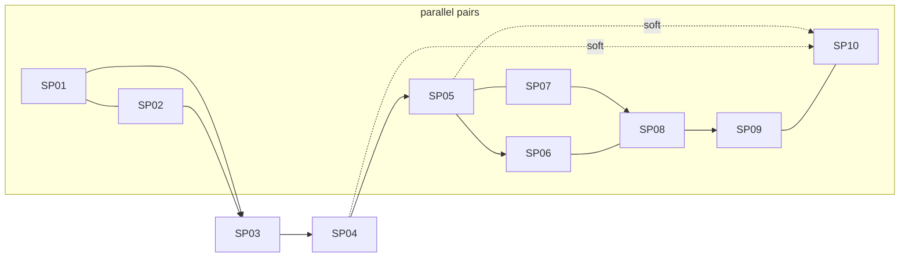

# crontick-improvements: PRD index

Source: [brainstorm.md](brainstorm.md) (approved). Deferred ideas: [docs/agent_files/futures.md](../futures.md). All PRDs are `status: draft`; no source code touched yet.

## TL;DR

Ten sub-projects: CLI polish, `daemon.port` + dashboard polish, config surfaces + Settings UI (+ API hardening), dashboard job editor, `--after` and `--webhook` triggers, opt-in autostart (Linux, macOS, Windows), opt-in catch-up. Biggest risks: SP07/08/09 interface mismatch (see Contradictions), SP09 launcher-survival unknown, SP06 HMAC-over-smee. ~53 OPEN lines remain; about 17 need an owner decision, rest are verify-during-implementation.

## Sub-projects

| # | Folder | Scope | Depends on | Phase | OPEN |
|---|---|---|---|---|---|
| 01 | [01-cli-polish](01-cli-polish/PRD.md) | Schedule help + footer, `--dir`, `resolveJobRef`, `runs delete` | none | 1 | 1 |
| 02 | [02-port-and-dashboard-polish](02-port-and-dashboard-polish/PRD.md) | `daemon.port` config, drop env var, rem scale ~80%, trimmed header | none | 1 | 1 |
| 03 | [03-config-surfaces-and-settings](03-config-surfaces-and-settings/PRD.md) | `config list/get/set/unset`, `/api/config`, Settings modal, **request guard on all mutating routes**, **daemon pause/resume + stop-vs-wait on in-flight edits** | 02 | 2 | 4 |
| 04 | [04-dashboard-job-editor](04-dashboard-job-editor/PRD.md) | "+" create / pencil edit, `job-prepare.ts`, `SCHEDULE_KINDS` | 03, 01 | 2 | 4 |
| 05 | [05-after-trigger](05-after-trigger/PRD.md) | `after` kind, `onRunComplete`, `TriggerDispatcher`, `trigger_json` | 01, 04 | 3 | 5 |
| 06 | [06-webhook-trigger](06-webhook-trigger/PRD.md) | `webhook` kind, smee-style SSE relay, `jobs trigger` | 05, 01, 04, 03 | 3 | 7 |
| 07 | [07-autostart-core-linux](07-autostart-core-linux/PRD.md) | `autostart enable/disable/status`, backend interface, systemd, guard rewrite | none | 3 | 6 |
| 08 | [08-autostart-macos](08-autostart-macos/PRD.md) | LaunchAgent backend | 07 | 3 | 10 |
| 09 | [09-autostart-windows](09-autostart-windows/PRD.md) | schtasks logon-task backend | 07 (+08 alignment) | 4 | 11 |
| 10 | [10-catch-up](10-catch-up/PRD.md) | Job `catchUp` flag, run latest missed fire once | 05 (soft), 04 (soft), 01 | 4 | 4 |

## Execution order

Max 2 parallel; same-file work sequential: `01 || 02 -> 03 -> 04 -> 05 || 07 -> 06 || 08 -> 09 || 10`.

Gate: resolve the SP07/08/09 interface deltas (below) BEFORE coding SP07; they change SP07's exit code and `AutostartSpec`.

## Locked decisions (see brainstorm.md decision log)

- No backward compat; remove outright, no aliases (global).
- One shared id-or-alias resolver; orphan `runs delete --job` falls back to raw id (global, item 6).
- `daemon.port` config only, explicit busy port fails loudly, env var removed, editable in config surfaces only by config-file edit with no daemon running, dashboard read-only (item 1; owner decision, SP03 R16).
- Dashboard ~80% via rem scale; header `v... · pid ...` + red error badge (items 2-3).
- `--dir` (no short flag) replaces `-C, --cwd`; stored field stays `cwd` (item 5).
- **API hardening (item 10) MOVED from SP04 to SP03**: Host/Content-Type/Origin guard on ALL mutating daemon routes, because `PATCH /api/config` can set engine commands. SP04/05/06 consume it. Pending owner review.
- No tokens/remote access; webhook via outbound SSE relay only; no inbound listener (item 12).
- Autostart reintroduced, opt-in, no native deps/Run key/VBS/admin; rule-8 sign-off done in brainstorm, restated in PR (item 13).
- Catch-up per-job, default off, latest missed fire runs once, rest `skipped` (item 14).

## Cross-cutting interfaces

| From | Interface | Consumed by |
|---|---|---|
| SP01 | `resolveJobRef` (`src/utils/job-ref.ts`), `SCHEDULE_FLAGS`, `commonJobOptions`, alias `all` reserved | 05, 06 (append flags, call resolver), 04 labels |
| SP02 | `daemon` config section + `PersistedDaemonConfigSchema`, `writeTestConfig` helper, rem scale | 03 (read-only guard), 04/03 CSS |
| SP03 | `request-guard.ts` (all mutating routes), `applyOps`, Settings modal + dirty-confirm string | 04 (JSON header), 06 (`/trigger`, `/relay/new`), 05 |
| SP04 | `job-prepare.ts` (`prepareCreate/Update`), `SCHEDULE_KINDS` registry, `null`-clears in patch | 05, 06, 10 |
| SP05 | `TriggerDispatcher`/`TriggerRequest`, `RunContext` + `buildRunEnv`, `isTimeSchedule`, `runs.trigger_json`, `describeSchedule` | 06, 10 |
| SP07 | `AutostartBackend`/`AutostartService`/`AutostartSpec`, `EXIT_ALREADY_RUNNING=75`, guard-test rewrite, ADR 0034 | 08, 09 |
| SP10 | `Job.catchUp`, `dispatchTimeRun`, `Scheduler.latestFireBefore`, `supportsCatchUp` registry flag | 04 editor entry |

### Contradictions / gaps found

| # | Where | Issue | Suggested fix |
|---|---|---|---|
| C1 | 07 vs 08 | 07: `SuccessExitStatus=75` avoids crash loop. 08: launchd `KeepAlive{SuccessfulExit:false}` respawns on 75 every 30 s. 08 proposes `CRONTICK_SUPERVISED=1` in `spec.env` -> daemon exits 0 (core delta, drift compares it). | Owner picks: supervised-exit-0 for all platforms (07 reworked) or macOS drops KeepAlive |
| C2 | 07 vs 09 | 07 D3 launches `daemon/index.js` directly; 09 launches `node cli/index.js daemon start` (launcher). Needs `AutostartSpec.cliScript` (delta A) and `backend.expectedCommand(spec)` (delta B) in 07. Brainstorm said "node.exe directly"; 09 still uses node.exe, only the entry script differs. | Add both to 07 before coding |
| C3 | 07/08 | PATH snapshot: 07 says core env = `CRONTICK_HOME` only plus (Linux) PATH; 08 D9 claims "same as 07" and adds PATH in the macOS backend. | Move PATH snapshot into core `buildSpec` |
| C4 | 09 | Task actions carry no env, so `CRONTICK_HOME` set at enable time is lost at logon. 09 suggests SP01 `--dir`, but that flag is the job-cwd option and does not apply to `daemon start`. | Needs a decision (new `daemon start --home`? document limitation + drift) |
| C5 | 05 vs 06 | `trigger_json` owner: consistent (SP05 creates column + guarded `ALTER`, SP06 fills/renders). But SP05 OPEN leaves "who renders in `runs get`" open while SP06 R12 claims it. | Settle: SP06 renders; SP05 only stores `{kind, upstream}` |
| C6 | 04 vs 05 | `job-prepare.ts` (04) has no `resolveJob` injection; 05 needs one (client = API lookup, daemon = `store.getJob`). | Add injected `resolveJob` in SP04 |
| C7 | 05 vs 10 | Two time-agnostic dispatch paths: 05 `TriggerDispatcher` (no `recordTick`) vs 10 `dispatchTimeRun` (with `recordTick`). 10 also needs `RunContext` env from 05 though listed as soft. | Treat 05 as hard dep of 10; keep two functions, document why |
| C8 | 03/04/06 | New routes (`/api/jobs/editor-meta`, `?prepare=1`, `/trigger`, `/relay/new`) must sit behind the SP03 guard; PRDs 04/06 assume it but none lists it as an AC. | SP03 AC already enumerates all mutating routes; keep that test |
| C9 | ADR numbers | See table below: 05/06 propose unnumbered ADRs; 07 claims 0034 and flags collision. | Assign up front |
| C10 | 06 vs 03 | 06 extends `redactValue` for relay/secret; 03 OPEN-6 already notes `redactValue` over-scrubbing. Shared function, two owners. | SP06 adds a separate `redactForLlm` branch, no change to `redactValue` core |

ADR numbers proposed by each PRD:

| SP | ADR proposal |
|---|---|
| 01-04 | none (02: spec R-004-1/1a; 03: config spec) |
| 05 | "ADR (trigger dispatch + no-replay)", unnumbered |
| 06 | "ADR outbound relay vs loopback-only", unnumbered |
| 07 | new **0034** (index row; body as section in ADR 0001; also edits 0001 "no reboot autostart") |
| 08 / 09 | macOS / Windows sections inside 0034 |
| 10 | amends "0015" = a section of ADR 0001 (+ index row) |

Proposal: 0034 autostart (07-09), 0035 trigger dispatch (05), 0036 webhook relay (06). Files 07 and 10 both edit ADR 0001; sequential (07 before 10), no conflict.

## Consolidated [OPEN] questions

Legend: **O** = owner decision, **V** = verify during implementation.

| SP | Item | Kind |
|---|---|---|
| 01 | Live job log keeps lines of deleted runs: accept vs rewrite file | O |
| 01 | No global `-d` option elsewhere clashes with `--dir` — RESOLVED: no `-d` short flag; `--dir` only | V |
| 01 | Single txn for large `runs delete --job` — RESOLVED: single txn bounded by retention.maxRunsPerJob | V |
| 02 | Test-isolation helper vs scan guard (OPEN-2) — RESOLVED: helper only | V |
| 02 | Windows EACCES on reserved port ranges (OPEN-3) — RESOLVED: accept, name port + config key | V |
| 02 | Slow crontick shown as "not crontick" on probe timeout (OPEN-4) — RESOLVED: accepted | V |
| 02 | Scale factor 0.8 vs narrower after screenshot (OPEN-5) | O |
| 03 | Remove superseded public exports in `src/index.ts` (OPEN-2) — RESOLVED: remove exports + update library-api docs/examples | O |
| 03 | Warn on removing engine used by jobs (OPEN-3) — RESOLVED: warn when daemon up, not block | O (leaning defer) |
| 03 | Stale "config init --force" wording only (OPEN-4) — RESOLVED: wording fix only | V |
| 03 | Lock on odd FS / Windows EPERM retry (OPEN-5) — RESOLVED: add retry-on-EPERM; Windows manual test | V |
| 03 | `[REDACTED]` scrubbing inside args, no `--reveal` (OPEN-6) — RESOLVED: accepted | O |
| 03 | Reload while runs active is safe (OPEN-7) — RESOLVED: integration spot-check | V |
| 03 | Bodyless mutating requests need JSON Content-Type (OPEN-8, new) — RESOLVED: strict, all three required | O |
| 04 | `prepare=1` flag vs always-normalize (OPEN-2) | V |
| 04 | `null`-clears exposed on MCP/library too (OPEN-3) | O |
| 04 | Dir path autocomplete endpoint (OPEN-4) | O (leaning defer) |
| 04 | Expose `retry.backoffSec` as "advanced" (OPEN-5) — RESOLVED: expose under advanced | O |
| 04 | No warning when editing job with in-flight run/dependents (OPEN-6) — RESOLVED: confirm at Save; stop in-flight runs or wait (pause job, apply, auto-resume) | V |
| 03 | `daemon pause`/`resume` user-facing (CLI/MCP/dashboard) or internal-only (OPEN-9, new; rec: user-facing) | O |
| 03 | Fires due while paused: skip vs run once on resume (OPEN-10, new; rec: skip, recorded `skipped`) | O |
| 03 | Paused state persists across daemon restart (OPEN-11, new; rec: no) | O |
| 03 | Timeout for "wait for runs to complete" (OPEN-12, new; rec: none by default) | O |
| 04 | `datetime-local` parsed as local like `--at` (OPEN-7) — RESOLVED: local only, no tz selector; Windows cmd-line length (OPEN-8) — RESOLVED: accepted; no DOM harness for dashboard tests | V |
| 05 | Where `runs get` renders `trigger_json`; migration pattern | V |
| 05 | `skip` overlap drops triggers: docs recommend `queue` | V |
| 05 | Stats output renders schedule? | V |
| 05 | Import with unresolved upstream: fail vs import disabled | O |
| 05 | Delete with dependents: refuse + `--force` vs prompt | O |
| 06 | HMAC over smee-parsed body may not match GitHub signature; test real delivery | V |
| 06 | smee.io availability/limits; self-host option | O |
| 06 | `relay`/`secret` plaintext in jobs file vs keychain | O |
| 06 | Export/import strips relay+secret by default | O |
| 06 | Burst 10/min, dedupe window values; non-GitHub header allowlist | V |
| 07 | SIGTERM exit code 0; `SuccessExitStatus`/`RestartPreventExitStatus` behavior on 75 | V |
| 07 | PATH snapshot goes stale | V |
| 07 | MCP `autostart enable` lets an agent create login persistence; status-only? | O |
| 07 | ADR 0034 number collision; `_npx` path warn vs refuse | O |
| 08 | Interface delta (C1) | O |
| 08 | Label domain `dev.crontick.*` | O |
| 08 | BTM toggle vs `print-disabled`; bootstrap error 5 after Login Items off; `AbandonProcessGroup`/TCC attribution; `launchctl print` format drift | V (real Mac) |
| 08 | Claude "Not logged in" under launchd | V (real Mac) |
| 09 | Detached daemon survives task instance ending (blocking) | V (Windows CI, first) |
| 09 | Standard user can create `\crontick\` folder; else root-level `\crontick-daemon` (changes locked decision) | V then O |
| 09 | `/query /xml` code page; SID `UserId` non-admin; domain/AAD logon trigger; no OS toggle for tasks | V |
| 09 | Deltas A/B (`cliScript`, `expectedCommand`) and `CRONTICK_HOME` loss (C2, C4) | O |
| 10 | Sleep/wake behavior of timers (follow-up, not SP10) | V |
| 10 | Login storm of many catch-up jobs; no global concurrency cap | O (count owner's jobs) |
| 10 | Stale-prompt max-age option (deferred) | O (leaning defer) |
| 10 | enable/`recordTick` change ownership vs SP05 enable guard | V |

## Owner manual steps

| Step | SP |
|---|---|
| Restate rule-8 (autostart reintroduction) sign-off in the PR description | 07 |
| Linux desktop check: enable, reboot/login, disable (systemd --user, no linger) | 07 |
| Mac checklist: enable, Login Items notification, relaunch, double-enable no-op, disable, demand-start-first loop check | 08 |
| Approve item in System Settings > Login Items if prompted; toggle off and confirm status; record shown name | 08 |
| Mac: cwd in `~/Documents` (TCC) and Claude-engine job under launchd; if "Not logged in", set `CLAUDE_CODE_OAUTH_TOKEN` via engine env config, not the plist | 08 |
| Windows as standard (non-admin) user: enable, log off/on, console flash, `taskschd.msc` entry, disable; non-English + spaced/non-ASCII profile path | 09 |
| Corporate Windows/EDR device: record alert and allowlist; else Defender WDSI submission | 09 |
| Sign off core deltas A/B and `CRONTICK_HOME` handling | 07/09 |
| Configure GitHub webhook: Payload URL = relay URL, content type `application/json`, secret = `--webhook-secret`; redeliver test ping | 06 |
| Decide channel hygiene (treat relay URL as secret, rotate) / optionally self-host smee | 06 |
| Screenshot review of dashboard scale (0.8), Settings modal, job editor at rem scale; try Claude create against untrusted dir (trust flow) | 02/03/04 |

## Next step

Owner reviews PRDs, resolves each [OPEN] as `[RESOLVED: ...]` or `[DEFERRED]` (start with the "O" rows and C1-C4, C9), then run `dev-tasks` to generate TASKS.md per SP.
