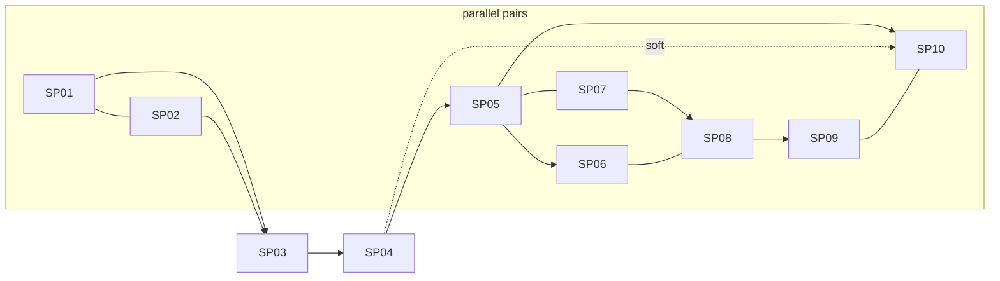

# crontick-improvements: PRD index

Source: [brainstorm.md](brainstorm.md) (approved). Deferred ideas: [docs/agent_files/futures.md](../futures.md). All PRDs are `status: draft`; no source code touched yet.

## TL;DR

Ten sub-projects: CLI polish, `daemon.port` + dashboard polish, config surfaces + Settings UI (+ API hardening), dashboard job editor, `--after` and `--webhook` triggers, opt-in autostart (Linux, macOS, Windows), opt-in catch-up. Biggest risks: SP09 launcher-survival unknown, SP06 HMAC-over-smee (the SP07/08/09 interface mismatch is resolved, see Contradictions). 1 OPEN item remains (SP04 DOM harness, verify-during-implementation); 0 need an owner decision. SP05-SP10 items are DEFERRED to implementation (owner, 2026-10-08).

## Sub-projects

| # | Folder | Scope | Depends on | Phase | OPEN (remaining) |
|---|---|---|---|---|---|
| 01 | [01-cli-polish](01-cli-polish/PRD.md) | Schedule help + footer, `--dir`, `resolveJobRef`, `runs delete` | none | 1 | 0 |
| 02 | [02-port-and-dashboard-polish](02-port-and-dashboard-polish/PRD.md) | `daemon.port` config, drop env var, rem scale ~80%, trimmed header | none | 1 | 0 |
| 03 | [03-config-surfaces-and-settings](03-config-surfaces-and-settings/PRD.md) | `config list/get/set/unset`, `/api/config`, Settings modal, **request guard on all mutating routes**, **daemon pause/resume + stop-vs-wait on in-flight edits** (pause/resume user-facing) | 02 | 2 | 0 |
| 04 | [04-dashboard-job-editor](04-dashboard-job-editor/PRD.md) | "+" create / pencil edit, `job-prepare.ts`, `SCHEDULE_KINDS` | 03, 01 | 2 | 1 (V) |
| 05 | [05-after-trigger](05-after-trigger/PRD.md) | `after` kind, `onRunComplete`, `TriggerDispatcher`, `trigger_json` | 01, 04 | 3 | 0 |
| 06 | [06-webhook-trigger](06-webhook-trigger/PRD.md) | `webhook` kind, smee-style SSE relay, `jobs trigger` | 05, 01, 04, 03 | 3 | 0 |
| 07 | [07-autostart-core-linux](07-autostart-core-linux/PRD.md) | `autostart enable/disable/status`, backend interface, systemd, guard rewrite, `daemon start --home`; MCP status only | none | 3 | 0 |
| 08 | [08-autostart-macos](08-autostart-macos/PRD.md) | LaunchAgent backend | 07 | 3 | 0 |
| 09 | [09-autostart-windows](09-autostart-windows/PRD.md) | schtasks logon-task backend | 07 (+08 alignment) | 4 | 0 |
| 10 | [10-catch-up](10-catch-up/PRD.md) | Job `catchUp` flag, run latest missed fire once | 05 (hard), 04 (soft), 01 | 4 | 0 |

## Execution order

Max 2 parallel; same-file work sequential: `01 || 02 -> 03 -> 04 -> 05 || 07 -> 06 || 08 -> 09 || 10`.

Gate (cleared): the SP07/08/09 interface deltas (C1-C4 below) are resolved and folded into SP07 (`CRONTICK_SUPERVISED`, `AutostartSpec.cliScript`, `expectedCommand`, PATH in `buildSpec`, `daemon start --home`).

## Locked decisions (see brainstorm.md decision log)

- No backward compat; remove outright, no aliases (global).
- One shared id-or-alias resolver; orphan `runs delete --job` falls back to raw id (global, item 6).
- `daemon.port` config only, explicit busy port fails loudly, env var removed, editable in config surfaces only by config-file edit with no daemon running, dashboard read-only (item 1; owner decision, SP03 R16).
- Dashboard ~80% via rem scale; header `v... · pid ...` + red error badge (items 2-3).
- `--dir` (no short flag) replaces `-C, --cwd`; stored field stays `cwd` (item 5).
- **API hardening (item 10) MOVED from SP04 to SP03**: Host/Content-Type/Origin guard on ALL mutating daemon routes, because `PATCH /api/config` can set engine commands. SP04/05/06 consume it. Owner approved (2026-10-08).
- No tokens/remote access; webhook via outbound SSE relay only; no inbound listener (item 12).
- Autostart reintroduced, opt-in, no native deps/Run key/VBS/admin; rule-8 sign-off done in brainstorm, restated in PR (item 13). MCP exposes autostart status only: a deliberate surface-parity exception encoded in `SURFACE_CAPABILITIES` and `surface-drift.test.ts` (owner decision).
- `daemon pause`/`resume` are user-facing (CLI, MCP, dashboard); fires due while paused are `skipped`; paused state is not persisted; no wait timeout (SP03, owner decision).
- Catch-up per-job, default off, latest missed fire runs once, rest `skipped` (item 14).

## Cross-cutting interfaces

| From | Interface | Consumed by |
|---|---|---|
| SP01 | `resolveJobRef` (`src/utils/job-ref.ts`), `SCHEDULE_FLAGS`, `commonJobOptions`, alias `all` reserved | 05, 06 (append flags, call resolver), 04 labels |
| SP02 | `daemon` config section + `PersistedDaemonConfigSchema`, `writeTestConfig` helper, rem scale | 03 (read-only guard), 04/03 CSS |
| SP03 | `request-guard.ts` (all mutating routes), `applyOps`, daemon `pause`/`resume` (user-facing), Settings modal + dirty-confirm string | 04 (JSON header), 06 (`/trigger`, `/relay/new`), 05 |
| SP04 | `job-prepare.ts` (`prepareCreate/Update`, injected `resolveJob`), `SCHEDULE_KINDS` registry, `null`-clears in patch (all surfaces) | 05, 06, 10 |
| SP05 | `TriggerDispatcher`/`TriggerRequest`, `RunContext` + `buildRunEnv`, `isTimeSchedule`, `runs.trigger_json` (stores `{kind, upstream}`; SP06 renders), `describeSchedule` | 06, 10 (hard) |
| SP07 | `AutostartBackend` (+ optional `expectedCommand`)/`AutostartService`/`AutostartSpec` (+ `cliScript`, PATH in `buildSpec`), `CRONTICK_SUPERVISED=1` (already-running exit 0), `daemon start --home`, guard-test rewrite, ADR 0034 | 08, 09 |
| SP10 | `Job.catchUp`, `dispatchTimeRun`, `Scheduler.latestFireBefore`, `supportsCatchUp` registry flag | 04 editor entry |

### Contradictions / gaps found

All ten resolved by the owner (delegated: README's proposed fix adopted). The affected PRDs are amended.

| # | Where | Issue | Resolution (status: RESOLVED) |
|---|---|---|---|
| C1 | 07 vs 08 | 07: `SuccessExitStatus=75` avoids crash loop. 08: launchd `KeepAlive{SuccessfulExit:false}` respawns on 75 every 30 s. | RESOLVED: `CRONTICK_SUPERVISED=1` in `spec.env` on all platforms; an already-running daemon exits 0 when supervised (unsupervised keeps non-zero). SP07 reworked (no exit 75, no `SuccessExitStatus`); SP08 keeps `KeepAlive{SuccessfulExit:false}`; SP08 interface-delta OPEN resolved. |
| C2 | 07 vs 09 | 07 D3 launches `daemon/index.js`; 09 launches `node cli/index.js daemon start`. | RESOLVED: SP07 gains `AutostartSpec.cliScript` (delta A) and optional `backend.expectedCommand(spec)` (delta B, default `[daemonScript]`). SP09 deltas A/B resolved. |
| C3 | 07/08 | PATH snapshot: 07 vs 08 D9 disagree on who adds it. | RESOLVED: PATH snapshot built in core `buildSpec` (SP07); SP08 no longer adds PATH. |
| C4 | 09 | Task actions carry no env, so `CRONTICK_HOME` is lost at logon; SP01 `--dir` is the job-cwd option. | RESOLVED: new `daemon start --home <dir>` flag, owned by SP07 core, used by SP09 task arguments. |
| C5 | 05 vs 06 | `trigger_json` rendering owner unclear. | RESOLVED: SP06 renders (`runs get`/dashboard); SP05 only stores `{kind, upstream}`. SP05's migration-pattern question stays V. |
| C6 | 04 vs 05 | `job-prepare.ts` has no `resolveJob` injection; 05 needs one. | RESOLVED: injected `resolveJob` added to SP04 `job-prepare.ts` (client = API lookup, daemon = `store.getJob`). |
| C7 | 05 vs 10 | Two non-time dispatch paths; 10 needs 05's `RunContext`. | RESOLVED: SP05 is a hard dependency of SP10; two dispatch functions kept (`TriggerDispatcher.dispatch` without `recordTick`, `dispatchTimeRun` with it), documented in SP05/SP10. |
| C8 | 03/04/06 | New routes must sit behind the SP03 guard; no AC listed them. | RESOLVED: SP03's guard AC enumerating all mutating routes is kept and now names SP04 `?prepare=1` and SP06 `/trigger`, `/relay/new`. |
| C9 | ADR numbers | 05/06 unnumbered; 07 claims 0034. | RESOLVED: 0034 autostart (07-09), 0035 trigger dispatch (05), 0036 webhook relay (06). SP05/06/07 PRDs updated; SP07's collision OPEN resolved. |
| C10 | 06 vs 03 | 06 extends `redactValue`; 03 OPEN-6 notes its over-scrubbing. | RESOLVED: SP06 adds a separate `redactForLlm` branch for relay/secret; `redactValue` core unchanged. |

ADR numbers (assigned, C9):

| SP | ADR |
|---|---|
| 01-04 | none (02: spec R-004-1/1a; 03: config spec) |
| 05 | **0035** trigger dispatch + no-replay |
| 06 | **0036** outbound relay vs loopback-only |
| 07 | **0034** autostart (index row; body as section in ADR 0001; also edits 0001 "no reboot autostart") |
| 08 / 09 | macOS / Windows sections inside 0034 |
| 10 | amends "0015" = a section of ADR 0001 (+ index row) |

Assigned: 0034 autostart (07-09), 0035 trigger dispatch (05), 0036 webhook relay (06). Files 07 and 10 both edit ADR 0001; sequential (07 before 10), no conflict.

## Consolidated [OPEN] questions

Legend: **O** = owner decision, **V** = verify during implementation. Status: RESOLVED / DEFERRED / OPEN (remaining). Remaining open: 1 (0 O, 1 V).

| SP | Item | Kind | Status |
|---|---|---|---|
| 01 | Live job log keeps lines of deleted runs: leave them, no documentation | O | RESOLVED |
| 01 | No global `-d` option elsewhere clashes with `--dir`: no `-d` short flag; `--dir` only | V | RESOLVED |
| 01 | Single txn for large `runs delete --job`: single txn bounded by retention.maxRunsPerJob | V | RESOLVED |
| 02 | Test-isolation helper vs scan guard (OPEN-2): helper only | V | RESOLVED |
| 02 | Windows EACCES on reserved port ranges (OPEN-3): accept, name port + config key | V | RESOLVED |
| 02 | Slow crontick shown as "not crontick" on probe timeout (OPEN-4): accepted | V | RESOLVED |
| 02 | Scale factor (OPEN-5): ship 0.8; adjust at screenshot review if needed | O | RESOLVED |
| 03 | Remove superseded public exports in `src/index.ts` (OPEN-2): remove exports + update library-api docs/examples | O | RESOLVED |
| 03 | Warn on removing engine used by jobs (OPEN-3): warn when daemon up, not block | O | RESOLVED |
| 03 | Stale "config init --force" wording only (OPEN-4): wording fix only | V | RESOLVED |
| 03 | Lock on odd FS / Windows EPERM retry (OPEN-5): add retry-on-EPERM; Windows manual test | V | RESOLVED |
| 03 | `[REDACTED]` scrubbing inside args, no `--reveal` (OPEN-6): accepted | O | RESOLVED |
| 03 | Reload while runs active is safe (OPEN-7): integration spot-check | V | RESOLVED |
| 03 | Bodyless mutating requests need JSON Content-Type (OPEN-8): strict, all three required | O | RESOLVED |
| 03 | `daemon pause`/`resume` user-facing (OPEN-9): user-facing on CLI, MCP, dashboard; surface parity | O | RESOLVED |
| 03 | Fires due while paused (OPEN-10): skipped, recorded `skipped` | O | RESOLVED |
| 03 | Paused state across restart (OPEN-11): not persisted; restart comes up unpaused | O | RESOLVED |
| 03 | Timeout for wait-for-runs (OPEN-12): none | O | RESOLVED |
| 04 | `prepare=1` flag vs always-normalize (OPEN-2): `?prepare=1` flag on create/update | O | RESOLVED |
| 04 | `null`-clears exposed on MCP/library too (OPEN-3): all surfaces, one schema; CLI via single `jobs update --unset <field>` flag; library-api.md + mcp-tools.md + cli.md docs and tests required | O | RESOLVED |
| 04 | Dir path autocomplete endpoint (OPEN-4): no endpoint | O | DEFERRED |
| 04 | Expose `retry.backoffSec` as "advanced" (OPEN-5): expose under advanced | O | RESOLVED |
| 04 | No warning when editing job with in-flight run/dependents (OPEN-6): confirm at Save; stop in-flight runs or wait | V | RESOLVED |
| 04 | `datetime-local` parsed as local like `--at` (OPEN-7); Windows cmd-line length (OPEN-8) | V | RESOLVED |
| 04 | No DOM harness for dashboard tests (string/HTTP only) | V | OPEN |
| 05 | Where `runs get` renders `trigger_json`: SP06 renders, SP05 stores `{kind, upstream}` | V | RESOLVED |
| 05 | `trigger_json` migration pattern (additive, guarded `ALTER`) | V | DEFERRED (verify in task) |
| 05 | `skip` overlap drops triggers: docs recommend `queue` | V | DEFERRED (verify in task) |
| 05 | Stats output renders schedule? | V | DEFERRED (verify in task) |
| 05 | Import with unresolved upstream: import the job disabled with `AFTER_UPSTREAM_NOT_FOUND` error; rest of import succeeds | O | RESOLVED |
| 05 | Delete with dependents: refuse, naming `--force` | O | RESOLVED |
| 06 | HMAC over smee-parsed body may not match GitHub signature; test real delivery | V | DEFERRED (verify in task) |
| 06 | smee.io availability/limits: accept smee.io default; document self-hosting a smee server | O | RESOLVED |
| 06 | `relay`/`secret` storage: plaintext in jobs file (0600) + redaction; no keychain | O | RESOLVED |
| 06 | Export/import: strip relay+secret by default | O | RESOLVED |
| 06 | Non-GitHub header allowlist: GitHub-only HMAC in v1; Stripe/GitLab | V | DEFERRED |
| 06 | Burst 10/min, dedupe window values | V | DEFERRED (verify in task) |
| 07 | Daemon exit code on SIGTERM must be 0 (verify shutdown path, add test) | V | DEFERRED (verify in task) |
| 07 | `SuccessExitStatus`/`RestartPreventExitStatus` on 75 | V | RESOLVED (superseded by C1) |
| 07 | PATH snapshot goes stale: accept, show "re-run enable" hint | V | RESOLVED |
| 07 | MCP autostart: status only, no enable/disable (deliberate parity exception) | O | RESOLVED |
| 07 | ADR 0034 number collision: 0034/0035/0036 assigned (C9) | O | RESOLVED |
| 07 | `_npx` ephemeral path: refuse enable | O | RESOLVED |
| 08 | Interface delta (C1): `CRONTICK_SUPERVISED=1`, exit 0 | O | RESOLVED |
| 08 | Label domain: `dev.crontick.daemon` | O | RESOLVED |
| 08 | No other core delta needed (`logsDir` from `spec.env`, `inspect()` fits) | V | DEFERRED (verify in task) |
| 08 | BTM toggle vs `print-disabled`; bootstrap error 5 after Login Items off | V (real Mac) | DEFERRED (verify in task) |
| 08 | `AbandonProcessGroup`/TCC attribution | V (real Mac) | DEFERRED (verify in task) |
| 08 | Claude "Not logged in" under launchd | V (real Mac) | DEFERRED (verify in task) |
| 08 | `launchctl print` format drift | V (real Mac) | DEFERRED (verify in task) |
| 09 | Detached daemon survives task instance ending (blocking) | V (Windows CI, first) | DEFERRED (verify in task) |
| 09 | Standard user can create `\crontick\` folder; else root-level `\crontick-daemon` fallback pre-approved by owner | V | DEFERRED (verify in task) |
| 09 | `/query /xml` code page | V | DEFERRED (verify in task) |
| 09 | SID `UserId` non-admin; domain/AAD logon trigger | V | DEFERRED (verify in task) |
| 09 | No OS toggle for tasks | V | DEFERRED (verify in task) |
| 09 | Paths with space / non-ASCII profile | V | DEFERRED (verify in task) |
| 09 | Deltas A/B (`cliScript`, `expectedCommand`) (C2) | O | RESOLVED |
| 09 | `CRONTICK_HOME` loss: `daemon start --home` (C4) | O | RESOLVED |
| 10 | Sleep/wake behavior of timers (follow-up, not SP10) | V | DEFERRED (verify in task) |
| 10 | Login storm of many catch-up jobs; no global concurrency cap: stagger/cap | O | DEFERRED |
| 10 | Stale-prompt max-age option (`futures.md`) | O | DEFERRED |
| 10 | enable/`recordTick` change ownership vs SP05 enable guard | V | DEFERRED (verify in task) |

## Owner manual steps

| Step | SP |
|---|---|
| Restate rule-8 (autostart reintroduction) sign-off in the PR description | 07 |
| Linux desktop check: enable, reboot/login, disable (systemd --user, no linger) | 07 |
| Mac checklist: enable, Login Items notification, relaunch, double-enable no-op, disable, demand-start-first loop check | 08 |
| Approve item in System Settings > Login Items if prompted; toggle off and confirm status; record shown name | 08 |
| Mac: cwd in `~/Documents` (TCC) and Claude-engine job under launchd; if "Not logged in", set `CLAUDE_CODE_OAUTH_TOKEN` via engine env config, not the plist | 08 |
| Windows as standard (non-admin) user: enable, log off/on, console flash, `taskschd.msc` entry, disable; non-English + spaced/non-ASCII profile path | 09 |
| Corporate Windows/EDR device: record alert and allowlist; else Defender WDSI submission | 09 |
| Configure GitHub webhook: Payload URL = relay URL, content type `application/json`, secret = `--webhook-secret`; redeliver test ping | 06 |
| Decide channel hygiene (treat relay URL as secret, rotate) / optionally self-host smee | 06 |
| Screenshot review of dashboard scale (0.8), Settings modal, job editor at rem scale; try Claude create against untrusted dir (trust flow) | 02/03/04 |

## Next step

SP05-SP10 OPEN items deferred to implementation (owner, 2026-10-08); SP03 request guard approved. No owner decisions remain (SP05 import with unresolved upstream: import disabled). Next: run `dev-tasks` to generate TASKS.md for SP05-SP10.
