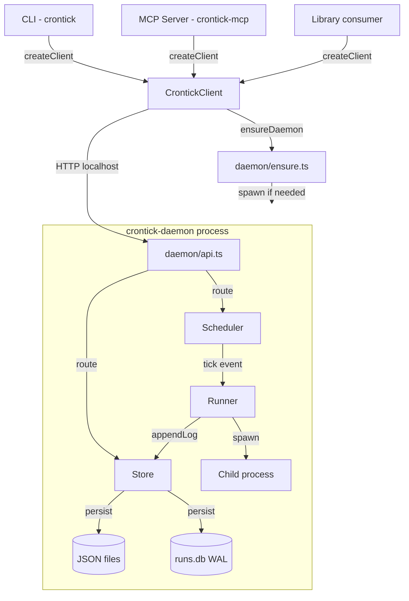

# Architecture

## Purpose

crontick is a standalone local cron daemon, CLI, and MCP server for scheduling and executing jobs on a single machine. It provides three equivalent interfaces (CLI, MCP server, library API) over a shared core client that communicates with a demand-started daemon process over loopback HTTP. Jobs may execute shell scripts, direct commands, or LLM prompt invocations on cron, interval, or one-shot schedules.

The project ships as a single npm package (`crontick`) containing three binaries and a programmatic library export. It targets developers who want local task automation with first-class support for LLM-driven prompt workflows, accessible from both command-line tooling and AI agent hosts via the Model Context Protocol.

## Scope and non-goals

crontick is:

- A single-machine, single-user scheduler.
- Demand-started (lazy): the daemon launches on first use, not at boot.
- An ESM-only Node.js package (>=22.5) using the built-in `node:sqlite` module.

crontick is NOT:

- A supervised always-on service. It does not install an OS service, launchd agent, systemd unit, or Windows Service. If the daemon dies, schedules pause until the next client interaction or explicit `daemon start`.
- A distributed or multi-node scheduler. There is no clustering, leader election, or shared state.
- A job queue with external brokers (Redis, RabbitMQ, etc.).
- A container orchestrator or process supervisor.
- A replacement for system cron for root/privileged tasks.
- A general-purpose task runner or CI system.

## Public API boundary

The npm package exports are defined by `package.json#exports["."]` which resolves to `dist/index.js` (source: `src/index.ts`). Everything exported from `src/index.ts` is public; everything else is internal.

Key public symbols:

| Category | Symbols |
|----------|---------|
| Client | `CrontickClient`, `createClient`, `CrontickClientOptions` |
| Error | `CrontickError` |
| Job input | `buildJobFromCreateOptions`, `buildJobPatchFromUpdateOptions`, `applyConfigDefaults`, `normalizeJobInput`, `normalizeJobPatch` |
| Schemas | `JobSchema`, `ScheduleSchema`, `PromptActionSchema`, `PromptEngineSchema`, `ConfigSchema`, `EngineConfigSchema` |
| Config | `BUILT_IN_CONFIG`, `addEngine`, `removeEngine`, `updateEngine`, `listEngines`, `loadConfig`, `initConfig`, `configFilePath`, `getConfigValue`, `setConfigValue`, `removeConfigValue`, `readConfigFile`, `writeConfigFile`, `validateConfigFile`, `buildPromptRunCommand` |
| Schema gen | `jobJsonSchema`, `jobJsonSchemaText` |
| Logger | `createLogger`, `nullLogger`, `isVerboseEnv`, `redactText`, `redactValue`, `sanitizeLogEvent` |
| Surface | `SURFACE_CAPABILITIES` |
| Version | `VERSION` |
| Types | `Job`, `JobInput`, `Schedule`, `Action`, `PromptAction`, `PromptEngine`, `CrontickConfig`, `EngineConfig`, `LogEvent`, `Logger`, `LogLevel`, `LogSink`, `SurfaceCapability`, `DashboardData`, `DashboardStatus`, etc. |

The three binaries (`crontick`, `crontick-daemon`, `crontick-mcp`) are CLI entry points, not importable APIs. Internal modules (everything under `src/daemon/`, `src/cli/`, `src/mcp/`, `src/schemas/`, and non-exported source files like `src/paths.ts`, `src/prompt-runtime.ts`) are implementation details and may change without notice. The `SURFACE_CAPABILITIES` export enumerates all 37 public operations; it is itself public so consumers can introspect available functionality.

## Major components

### CrontickClient (core)

`src/client.ts`. The single source of business logic accessible to external consumers. Every operation (job CRUD, run management, daemon lifecycle, config, stats, dashboard, doctor) is a method on this class. It handles daemon connectivity via `ensureDaemon()`, issues HTTP requests to the daemon API, and surfaces results or `CrontickError` instances. Config operations that do not require the daemon (e.g. `initConfig`, `validateConfig`) execute locally.

### CLI shim

`src/cli/index.ts`. A Commander v12 program that parses flags and positional arguments, instantiates `CrontickClient` via `createClient()`, calls the corresponding client method, and renders output to stdout (JSON or human-readable) or errors to stderr. Contains no scheduling, validation, or persistence logic. Exit codes: 0 (success), 1 (error).

### MCP server shim

`src/mcp/index.ts`. A stdio-transport MCP server (`@modelcontextprotocol/sdk`) that registers 37 tools and one resource (`crontick://schemas/job`). Each tool handler instantiates `CrontickClient`, delegates to the matching method, and returns a JSON text content block. Errors are returned with `isError: true`. The `redactForLlm()` helper strips loopback addresses and filesystem paths from error messages before returning them to the host.

### Library API shim

`src/index.ts`. A re-export facade. External consumers `import { createClient } from 'crontick'` and interact with the same `CrontickClient` used by CLI and MCP.

### Daemon

`src/daemon/index.ts`. A long-running Node.js process that binds to `127.0.0.1` on an ephemeral port. Responsibilities:

- Single-instance guard (PID file + `process.kill(pid, 0)` probe).
- SQLite shim: re-execs with `--experimental-sqlite` on Node < 24 if the flag is absent.
- On startup: opens Store, reconciles orphaned runs, loads jobs from disk, schedules enabled jobs.
- Listens for SIGINT/SIGTERM for graceful shutdown (unschedule all, close DB, remove PID/port files).

### Scheduler

`src/daemon/scheduler.ts`. An `EventEmitter` subclass managing per-job timers. Supports three schedule kinds: `cron` (via `croner` v9 with optional timezone), `interval` (`setInterval`), and `one-shot` (`setTimeout`). Emits `tick` events with `{ jobId, plannedAt }`. Also provides `preview()` (next N fire times) and `validate()` (parse check) as static-like utilities.

### Runner

`src/daemon/runner.ts`. Executes job actions as child processes via `spawn`. Enforces overlap policy (`skip`, `queue`, `cancel-previous`) using per-job `AbortController` and queue maps. Implements retry with configurable backoff. Captures stdout/stderr through `safeRedact()` before persisting to Store. Handles `script` (temp file + shell), `exec` (direct command), and `prompt` (engine-resolved command with optional session reuse) action kinds. Enforces per-job `timeoutSec` via the spawn `timeout` option (in ms).

### Store

`src/daemon/store.ts`. Dual persistence layer:

- **Job definitions**: individual JSON files under `<dataDir>/jobs/<id>.json` (source of truth) plus a JSON Schema sidecar (`<id>.schema.json`). On daemon startup, `loadJobsFromDisk()` reads all JSON files and populates the in-memory + SQLite cache.
- **Runs and logs**: SQLite database (`<dataDir>/runs.db`) in WAL journal mode. Tables: `jobs` (cache mirror with `id`, `json`, `updated_at`), `runs` (with `id`, `job_id`, `started_at`, `ended_at`, `status`, `exit_code`, `error`, `duration_ms`), `run_logs` (with `run_id`, `stream`, `ts`, `chunk` as BLOB), `migrations`. Indexes: `idx_runs_job_id`, `idx_runs_started_at`, `idx_run_logs_run_id`.

The Store class uses `node:sqlite` `DatabaseSync` for synchronous operations within the single-threaded daemon. It owns migrations (applied sequentially on open), CRUD for jobs/runs/logs, and orphan reconciliation on restart. Run statuses: `queued`, `running`, `success`, `failed`, `canceled`, `timeout`.

### Daemon ensure

`src/daemon/ensure.ts`. Shared by all three surfaces. Resolves the daemon base URL (from option, env var, or port file), probes health, and if needed acquires an exclusive file lock (`daemon.ensure.lock` via `openSync('wx')`) and spawns the daemon process with bounded timeout/retry. Constants: `DEFAULT_STARTUP_TIMEOUT_MS=10000`, `DEFAULT_HEALTH_TIMEOUT_MS=2000`, `DEFAULT_LOCK_TIMEOUT_MS=15000`, `POLL_MS=100`. The health endpoint must return product field `"crontick"` for the probe to succeed.

### Daemon API

`src/daemon/api.ts`. A plain `node:http` server created via `createApiServer(ctx)` where `ctx` contains references to `Store`, `Scheduler`, `Runner`, `reload()`, and `Logger`. Routes:

| Method | Path pattern | Purpose |
|--------|-------------|---------|
| GET | `/health` | Daemon health/status |
| GET/POST/PUT/DELETE | `/api/jobs[/:id][/enable\|disable\|run]` | Job CRUD + actions |
| GET/POST | `/api/runs[/:id][/cancel]` | Run queries + cancel |
| GET | `/api/runs/:id/logs` | Run log retrieval |
| GET | `/api/stats[/jobs/:id]` | Aggregate statistics |
| POST | `/api/daemon/reload\|stop\|restart` | Daemon lifecycle |
| POST | `/api/export`, `/api/import` | Bulk job export/import |
| GET/POST/DELETE | `/api/dashboard[/data\|status]` | Dashboard management |
| GET | `/api/doctor` | Health checks |
| GET/PUT/DELETE | `/api/config[/engines[/:name]]` | Config management |

All routes enforce loopback-only access. Request/response bodies are JSON.

## Control and data flow

End-to-end lifecycle: job definition, validation, persistence, daemon pickup, schedule evaluation, execution, run record.



### On-disk state layout

All state lives under a single data directory resolved by `src/paths.ts`:
- Override: `CRONTICK_HOME` environment variable.
- Default: platform-specific via `env-paths('crontick', { suffix: '' }).data` (e.g. `%LOCALAPPDATA%\crontick` on Windows, `~/.local/share/crontick` on Linux).

```
<dataDir>/
  config.json            User config (engines, defaultEngine)
  jobs/
    <id>.json            Job definition (source of truth)
    <id>.schema.json     JSON Schema sidecar
  runs.db                SQLite WAL: runs, run_logs, jobs cache, migrations
  logs/
    daemon-YYYY-MM-DD.log  Daemon JSON-lines log
    daemon.ensure.log      Demand-start stdout capture
  daemon.pid             PID of running daemon
  daemon.port            Port of daemon API
  daemon.ensure.lock     Exclusive startup lock
```

### Daemon startup sequence

1. Client calls `ensureDaemon()`.
2. `resolveDaemonBaseUrl()` checks for explicit `daemonUrl` option, then `CRONTICK_DAEMON_URL` env var, then reads `daemon.port` file.
3. If a URL is resolved, probe `GET /health`. If healthy, return immediately.
4. Acquire exclusive lock on `daemon.ensure.lock` (poll with `POLL_MS=100`, timeout `DEFAULT_LOCK_TIMEOUT_MS=15000`).
5. Double-check health (another client may have started the daemon while we waited for the lock).
6. Spawn `crontick-daemon` (or path from `CRONTICK_DAEMON_BINARY` / `daemonScript` option) as a detached child.
7. Poll `GET /health` until success or `DEFAULT_STARTUP_TIMEOUT_MS=10000` expires.
8. Release lock; return `DaemonInfo { baseUrl, port, pid, started: true }`.

### Detailed request sequence

1. User invokes CLI command, MCP tool, or library method.
2. Shim instantiates `CrontickClient` via `createClient()`.
3. Client calls `ensureDaemon()` which resolves the daemon URL (port file or env), probes `/health`, and spawns the daemon if not running.
4. Client issues an HTTP request to the daemon REST API on `127.0.0.1:<port>`.
5. Daemon API validates the payload (e.g. `JobSchema` for create), delegates to Store/Scheduler.
6. Store writes the job JSON file and upserts the SQLite `jobs` cache row.
7. Scheduler registers a timer (croner `Cron`, `setInterval`, or `setTimeout`).
8. On tick, Scheduler emits `{ jobId, plannedAt }`. Daemon inserts a `queued` run via `Store.insertRun()`.
9. Runner applies overlap policy, transitions run to `running`, spawns the child process.
10. Runner streams stdout/stderr through `safeRedact()` into `Store.appendLog()`.
11. On process exit, Runner finalizes the run record (status, exitCode, durationMs).
12. Client retrieves results via subsequent HTTP requests; shims render to their transport.

## Important invariants

These are architectural rules enforced by code, tests, or review policy. Violating them indicates a bug or design regression.

| Invariant | Enforcement mechanism |
|-----------|----------------------|
| Surface parity: every capability exists identically in client, CLI, and MCP | `SURFACE_CAPABILITIES` constant in `src/surface.ts` defines a 37-row mapping of `{ capability, clientMethod, cliCommand, mcpTool }`; `tests/surface-drift.test.ts` asserts: (a) every capability maps to a real `CrontickClient.prototype` method, (b) every client method is accounted for in the table or in the explicit `NON_PARITY_CLIENT_METHODS` set, (c) every MCP tool is registered, (d) every CLI command exists |
| Shims contain no business logic | Architecture review rubric (`.github/skills/review-crontick/SKILL.md`); scheduling, validation, persistence, error construction, schema generation live exclusively in core (client + daemon modules) |
| Loopback-only binding | `createApiServer` in `src/daemon/api.ts` checks `req.socket.remoteAddress` against `Set(['127.0.0.1', '::1', '::ffff:127.0.0.1'])`; non-loopback requests receive HTTP 403 with code `FORBIDDEN`; `tests/security.test.ts` verifies this |
| Single daemon instance per data directory | PID file (`daemon.pid`) written on startup; liveness probe via `process.kill(pid, 0)`; exclusive startup lock via `openSync('wx')` on `daemon.ensure.lock` with polling + timeout |
| Single writer to SQLite | Only the daemon process opens `runs.db` with `DatabaseSync`; all client surfaces access run/log data exclusively through daemon HTTP endpoints |
| Orphan run reconciliation on restart | `Store.reconcileOrphanRuns()` called at daemon startup; transitions all `running`/`queued` runs to `canceled` with `error = 'daemon-restart'` so no run appears permanently stuck |
| Core stays transport-agnostic | No `console.*`, `process.exit`, Commander types, or `@modelcontextprotocol/sdk` types in `src/client.ts`, `src/daemon/`, or shared modules (errors.ts, schemas/, logger.ts, paths.ts, etc.) |
| Job JSON files are source of truth | On daemon startup, `Store.loadJobsFromDisk()` reads all `<dataDir>/jobs/*.json` files; the SQLite `jobs` table is a cache mirror, not authoritative |
| Run status lifecycle | A run progresses: `queued` -> `running` -> terminal (`success` | `failed` | `canceled` | `timeout`). Once terminal, status is never mutated again |

## Error model

All errors surfaced to consumers are instances of `CrontickError` (extends `Error`) defined in `src/errors.ts`:

```typescript
class CrontickError extends Error {
  code: string;       // machine-readable identifier
  message: string;    // human-readable description
  details?: unknown;  // optional structured context
  toJSON(): { code: string; message: string; details?: unknown }
}
```

Error code families:

| Family | Example codes | Trigger |
|--------|--------------|---------|
| Daemon connectivity | `DAEMON_NOT_RUNNING`, `DAEMON_START_FAILED`, `DAEMON_TIMEOUT`, `DAEMON_START_LOCK_TIMEOUT`, `DAEMON_STOP_FAILED`, `DAEMON_REQUEST_FAILED` | Client cannot reach or start daemon |
| Validation | `VALIDATION_ERROR`, `PARSE_ERROR` | Schema validation failure (Zod) |
| Not found | `NOT_FOUND` | Job or run ID does not exist |
| Config | `CONFIG_EXISTS`, `CONFIG_READ_ERROR`, `CONFIG_VALIDATION_ERROR`, `CONFIG_KEY_ERROR`, `CONFIG_KEY_NOT_FOUND`, `CONFIG_ENGINE_NOT_FOUND`, `CONFIG_ENGINE_EXISTS`, `CONFIG_BUILTIN_ENGINE` | Config file operations |
| Runtime | `ENV_FILE_ERROR`, `FORBIDDEN`, `API_ERROR`, `NOT_BUILT`, `INTERNAL_ERROR` | Assorted runtime failures |

Surface mapping:

- **CLI**: catches `CrontickError`, prints `message` (and `details` in verbose mode) to stderr, exits with code 1.
- **MCP**: returns `{ content: [{ type: "text", text: JSON.stringify(error.toJSON()) }], isError: true }` after path/address redaction via `redactForLlm()`.
- **Library**: throws `CrontickError` directly to the caller.

### Observability

The `Logger` interface (`src/logger.ts`) provides structured log events with four levels: `error`, `warn`, `info`, `debug`. Log events carry `{ ts, level, component, message, data? }`. Each component creates a child logger with a scoped `component` field.

Rendering per surface:
- **Daemon**: writes JSON lines to `<dataDir>/logs/daemon-YYYY-MM-DD.log` and stderr.
- **CLI**: in verbose mode, renders log events to stderr; in normal mode, only errors surface.
- **MCP**: collects log events into a `diagnostics[]` array returned alongside tool results when verbose is enabled.
- **Library**: exposes `onLog?: LogSink` callback in `CrontickClientOptions`.

## Extension points

### Prompt engines

The config file (`<dataDir>/config.json`) defines named engines with `{ command: string, args: string[], env: Record<string, string> }`. Users manage engines via `config engines add/update/remove` (CLI), `crontick_config_engine_*` (MCP), or `addEngine`/`updateEngine`/`removeEngine` (library). The Runner resolves the engine at execution time via `buildPromptRunCommand()` from `src/config.ts`, which merges per-engine config with per-job `action.args` and optional `sessionId`.

The built-in default engine is `copilot` (`{ command: "copilot", args: [], env: {} }`), defined in `BUILT_IN_CONFIG`. Any CLI binary that accepts a prompt via arguments can be registered as an engine (the engine binary is invoked via `spawn` with the resolved args array).

### Executors (action kinds)

Three action kinds exist as a Zod discriminated union (`ActionSchema` in `src/schemas/job.ts`) keyed on `action.kind`:

| Kind | Shell behavior | Key fields |
|------|---------------|------------|
| `script` | Writes script to temp file, executes via resolved shell (bash/pwsh/cmd) | `script`, `shell` (auto/bash/pwsh/cmd), `cwd`, `env`, `envFile`, `timeoutSec` |
| `exec` | Direct spawn, `shell: false` always | `command`, `args[]`, `cwd`, `env`, `envFile`, `timeoutSec` |
| `prompt` | Resolves engine from config, spawns engine binary with prompt args | `prompt`, `engine`, `args[]`, `sessionId`, `reuseSession`, `cwd`, `env`, `envFile`, `timeoutSec` |

Adding a new kind requires: (1) extending `ActionSchema` discriminated union, (2) adding Runner dispatch logic in `Runner.spawn()`, (3) client/daemon API plumbing, (4) CLI flags, (5) MCP tool schema.

### Plugin directory

`plugin/` ships a Copilot marketplace plugin descriptor (`plugin.json`, id: `"crontick"`), an installer script (`install.mjs` which runs `npm install -g`, invokes `doctor`, copies `src/skill/SKILL.md`), and documentation. The bundled LLM skill (`src/skill/SKILL.md`) teaches an LLM how to create crontick jobs via natural language. The plugin is a distribution mechanism, not a general extensibility framework.

### Injectable boundaries (for testing and advanced usage)

| Boundary | How |
|----------|-----|
| Process spawning | `Runner` constructor accepts `spawnFn` (defaults to `node:child_process.spawn`) |
| Database path | `Store` constructor accepts `dbPath` and `jobsPath` parameters |
| Data directory | All path helpers in `src/paths.ts` accept an `env` parameter |
| Logging | `Logger` interface is fully injectable; `CrontickClientOptions.onLog` provides a `LogSink` callback |
| Daemon URL | `CrontickClientOptions.daemonUrl` bypasses port-file discovery |

## Dependency policy

Runtime dependencies (6 total):

| Package | Purpose | Why not a platform API |
|---------|---------|----------------------|
| `@modelcontextprotocol/sdk` | MCP server protocol implementation | Protocol-specific; no Node.js built-in |
| `commander` | CLI argument parsing | `node:util.parseArgs` lacks subcommands and help generation |
| `croner` | Cron expression parsing, scheduling, validation | No built-in cron parser in Node.js |
| `env-paths` | Cross-platform data directory resolution | Avoids manual per-OS path logic |
| `zod` | Schema validation (discriminated unions, coercion) | No built-in schema DSL in Node.js |
| `zod-to-json-schema` | JSON Schema generation from Zod schemas | Companion to zod for sidecar generation |

SQLite is provided by the Node.js built-in `node:sqlite` module (stable in Node 24; `--experimental-sqlite` flag auto-applied for Node 22/23 via daemon re-exec shim in `src/daemon/index.ts`).

Rules for adding dependencies:
- Prefer `node:*` built-in modules over third-party packages.
- No native/compiled dependencies.
- New runtime dependencies require explicit justification and review.
- Dev dependencies (`vitest`, `tsup`, `eslint`, `prettier`, `fast-check`, `typescript`, `@changesets/cli`) are build/test-time only and do not ship.

## Performance considerations

- **SQLite WAL mode**: set via `PRAGMA journal_mode=WAL` on `Store.open()`. Enables concurrent reads from daemon HTTP handlers while writes serialize through a single connection. `PRAGMA foreign_keys=ON` is also set for referential integrity.
- **Timer-based scheduling**: croner manages per-job `Cron` instances in-process (for cron schedules) or `setTimeout`/`setInterval` (for one-shot/interval). No polling loop; the Node.js event loop is idle between ticks.
- **Process spawn cost**: each job execution spawns a child process via `node:child_process.spawn`. For `script` actions, a temporary file is written to OS tempdir and passed to the resolved shell (bash/pwsh/cmd). The temp file is cleaned up after execution.
- **Synchronous SQLite**: `DatabaseSync` from `node:sqlite` blocks the event loop during writes. Run log appends (`Store.appendLog`) are the most frequent write and occur per-chunk during child process execution. This is acceptable for a single-user local daemon with modest concurrency.
- **Per-job overlap policy**: concurrency is bounded per-job (not globally) via the `overlap` field. `skip` drops concurrent ticks, `queue` serializes them, `cancel-previous` aborts the active run. There is no global concurrency limit.
- **Daemon demand-start latency**: first operation after daemon death incurs startup cost: process spawn + health probe polling at `POLL_MS=100` intervals, bounded by `DEFAULT_STARTUP_TIMEOUT_MS=10000`. Subsequent operations reuse the running daemon via cached base URL.
- **No daemon heartbeat**: the daemon does not self-terminate on idle. It remains running until explicitly stopped, the process is killed, or the system shuts down.

## Compatibility requirements

| Requirement | Value | Source |
|-------------|-------|--------|
| Node.js | `>=22.5` | `package.json#engines.node` |
| .nvmrc | `22` | `.nvmrc` |
| Module system | ESM-only | `"type": "module"` in package.json; tsup builds ESM format only |
| TypeScript target | ES2022 | `tsconfig.json#compilerOptions.target` |
| Module resolution | NodeNext | `tsconfig.json#compilerOptions.moduleResolution`; source uses `.js` extensions |
| Operating systems | Windows, macOS, Linux | CI matrix: `[windows-latest, ubuntu-latest]` x `[node 22, node 24]`; shell resolution: pwsh on Windows, bash elsewhere |
| CJS support | None | Single ESM output; `main` and `module` both point to `./dist/index.js`; no dual-publish |
| SQLite availability | Node.js built-in `node:sqlite` | Stable in Node 24; experimental in 22-23 (daemon auto-applies `--experimental-sqlite` flag) |
| Build tool | tsup v8 | Bundles four entry points (index, cli, daemon, mcp); all outputs get `#!/usr/bin/env node` banner |
| Package manager | npm | No lockfile for other managers; `prepublishOnly` runs build + test |

## Security considerations

### Trust boundary

The trust boundary is the local machine's user account. crontick assumes that any process able to connect to `127.0.0.1` on the daemon's ephemeral port is trusted. There is no authentication token, API key, or TLS on the daemon HTTP interface.

### Loopback enforcement

The daemon API (`src/daemon/api.ts`) enforces loopback-only access by checking `req.socket.remoteAddress` against the set `['127.0.0.1', '::1', '::ffff:127.0.0.1']`. Non-loopback connections receive HTTP 403 with error code `FORBIDDEN`. The server binds exclusively to `127.0.0.1` (not `0.0.0.0`).

### Arbitrary command execution

Job actions execute user-defined shell commands, direct executables, or prompt-engine binaries as the same OS user running the daemon. crontick provides no sandboxing, capability restriction, or allowlist for executable paths. Any command the user can run manually can be scheduled as a job.

### Secrets in job definitions

Job JSON files stored in `<dataDir>/jobs/` may contain sensitive data in environment variables, script bodies, or prompt content. These files are plain-text JSON with no encryption. The `safeRedact()` function in `src/daemon/runner.ts` and `redactText()`/`redactValue()` in `src/logger.ts` strip patterns matching common secret formats (AWS access keys, GitHub PATs, Bearer tokens, and env vars with names matching token/secret/password/credential/apikey) from log output before persisting to SQLite and writing to daemon log files.

### File permissions

crontick calls `mkdirSync(dir, { recursive: true })` for the data directory tree but does not explicitly set restrictive file permissions (e.g. `0o700`). Users on shared systems should manually restrict access to their data directory.

### Prompt-engine invocation

Prompt jobs delegate execution to external binaries resolved from config (e.g. `copilot`). crontick trusts the configured engine `command` and passes user-supplied `args` without validation or sandboxing. A malicious engine config could execute arbitrary code.

### MCP error redaction

`redactForLlm()` in `src/mcp/index.ts` strips loopback IP addresses and filesystem paths from error messages before returning them to the MCP host. This reduces accidental information leakage (local directory structure, port numbers) into LLM context windows.

### Env-file loading

`parseEnvFile()` in `src/daemon/runner.ts` reads `.env`-style files and injects their key-value pairs into the child process environment. The file path is user-specified per-job (`action.envFile`). No path traversal guard is applied beyond OS filesystem permissions.

### No network egress from daemon

The daemon process itself makes no outbound network calls. It only listens on loopback. Child processes spawned by job actions are unconstrained and may make arbitrary network calls.
