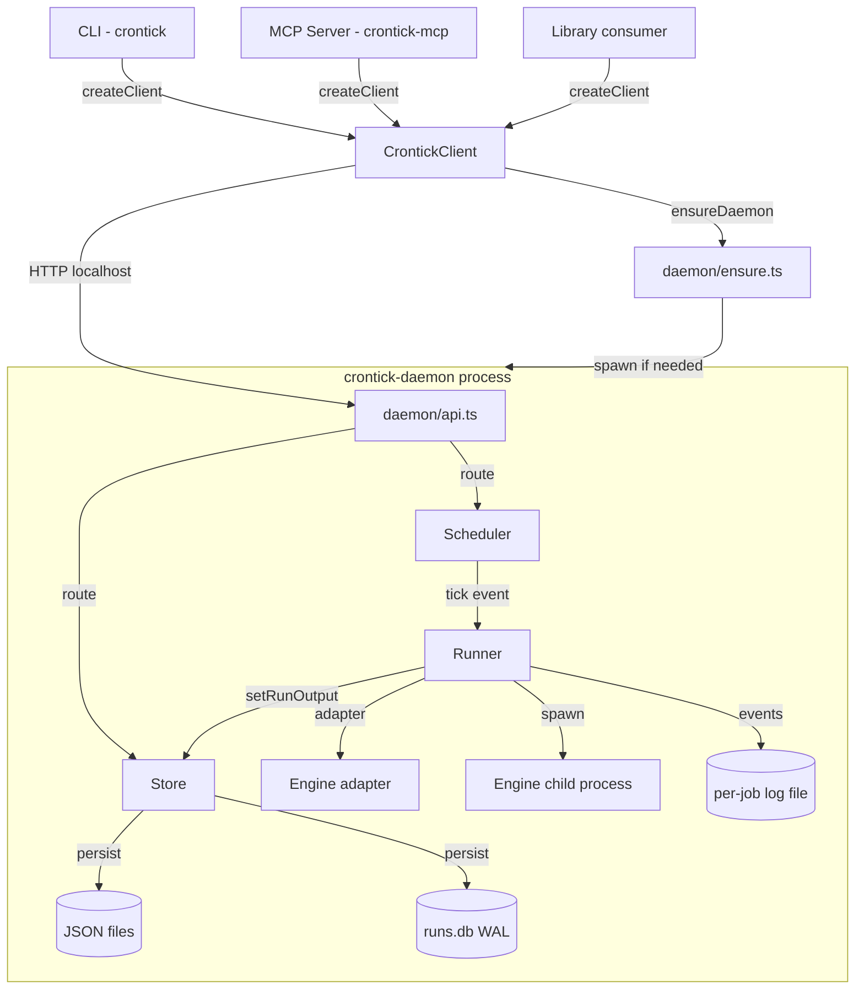

# Architecture

Audience: everyone -- the entry point for understanding how crontick's pieces fit together.
Non-duplication: this page is a components-and-links map, kept intentionally short. Full route
tables, schema detail, and implementation mechanics live in `docs/implementation/`; user-facing
mental models live in `docs/concepts/`; exact field/flag/code lookups live in `docs/reference/`.
Each section below links to its topic's one narrative owner instead of restating it.

## Purpose

crontick is a standalone local cron daemon, CLI, and MCP server for scheduling and executing prompt jobs on a single machine. It provides three equivalent interfaces (CLI, MCP server, library API) over a shared core client that communicates with a demand-started daemon process over loopback HTTP.

The project ships as a single npm package (`crontick`) with three binaries and a programmatic library export, targeting developers who want local scheduling for LLM-driven prompt workflows, from both command-line tooling and AI agent hosts via the Model Context Protocol.

## Scope and non-goals

crontick is a single-machine, single-user, demand-started (lazy) scheduler: an ESM-only Node.js package (>=22.5) using the built-in `node:sqlite` module. It is **not** a supervised always-on service (if the daemon dies, schedules pause until the next client interaction), not distributed, not a job queue with external brokers, not a container orchestrator, not a replacement for system cron, and not a general-purpose task runner -- job actions are prompt-only (see [ADR 0002](decisions/0002-prompt-only-jobs-and-engine-adapters.md)).

## Public API boundary

The npm package exports are defined by `package.json#exports["."]`, resolving to `dist/index.js` (source: `src/index.ts`). Only symbols exported there are public; everything else, including all of `src/daemon/`, `src/cli/`, `src/mcp/`, `src/schemas/`, and non-exported files (`src/paths.ts`, `src/prompt-runtime.ts`, `src/engines/`), is an internal implementation detail that may change without notice.

Key public categories: the `CrontickClient`/`createClient` core; `CrontickError` and its codes; job input builders (`buildJobFromCreateOptions`, `normalizeJobInput`, ...); schemas (`JobSchema`, `ScheduleSchema`, `PromptActionSchema`, `PromptEngineSchema`, `ConfigSchema`, `EngineConfigSchema`); config helpers (`BUILT_IN_CONFIG`, `addEngine`/`removeEngine`/`updateEngine`, `loadConfig`, `buildPromptRunCommand`); JSON Schema generation; logger utilities; `SURFACE_CAPABILITIES`; `VERSION`; and the corresponding TypeScript types. The three binaries (`crontick`, `crontick-daemon`, `crontick-mcp`) are CLI entry points, not importable APIs. `SURFACE_CAPABILITIES` enumerates all 22 public operations and is itself public so consumers can introspect available functionality.

## Major components

| Component | Source | Role |
|-----------|--------|------|
| **CrontickClient** (core) | `src/client.ts` | The single source of business logic. Every operation (job CRUD, run management, daemon lifecycle, config, stats, dashboard, doctor) is a method here. Handles daemon connectivity (`ensureDaemon()`), issues HTTP requests, surfaces `CrontickError`. See [implementation/core-client.md](implementation/core-client.md). |
| **CLI shim** | `src/cli/index.ts` | Commander v12 program: parses flags, calls `CrontickClient`, renders output. Zero business logic. See [implementation/shims.md](implementation/shims.md). |
| **MCP server shim** | `src/mcp/index.ts` | Stdio MCP server registering 22 tools + one resource (`crontick://schemas/job`). See [implementation/shims.md](implementation/shims.md). |
| **Library API shim** | `src/index.ts` | Re-export facade; `import { createClient } from 'crontick'`. |
| **Daemon** | `src/daemon/index.ts`, `api.ts`, `ensure.ts` | Long-running process bound to `127.0.0.1`; owns the scheduler, runner, and store behind a loopback HTTP API. See [implementation/daemon.md](implementation/daemon.md) and [concepts/daemon-lifecycle.md](concepts/daemon-lifecycle.md). |
| **Scheduler** | `src/daemon/scheduler.ts` | `EventEmitter` managing per-job timers for `cron` (croner v9), `interval`, and `one-shot` schedules; emits `tick`. See [implementation/scheduler.md](implementation/scheduler.md). |
| **Runner** | `src/daemon/runner.ts` | Spawns each job's prompt engine, enforcing overlap/retry/timeout, capturing redacted output. See [implementation/prompt-execution.md](implementation/prompt-execution.md). |
| **Shared modules** | `src/constants/`, `src/utils/` | Cross-file constants and defaults, grouped by domain (`daemon`, `job-input`, `retention`, `scheduler`); pure single-concern helpers. See [design principles](tech/design-principles.md). |
| **Engine adapters** | `src/engines/` | Per-engine invocation/result-parsing behind one contract (see [Engine adapters](#engine-adapters) below). |
| **Store** | `src/daemon/store.ts` | Dual persistence: job JSON files (source of truth) + SQLite (runs, run outputs, schedule state). See [implementation/storage.md](implementation/storage.md). |

## Control and data flow

```mermaid
flowchart TD
    CLI[CLI - crontick] -->|createClient| Client[CrontickClient]
    MCP[MCP Server - crontick-mcp] -->|createClient| Client
    LIB[Library consumer] -->|createClient| Client

    Client -->|ensureDaemon| Ensure[daemon/ensure.ts]
    Ensure -->|spawn if needed| Daemon

    Client -->|HTTP localhost| API[daemon/api.ts]

    subgraph Daemon[crontick-daemon process]
        API -->|route| Store[Store]
        API -->|route| Sched[Scheduler]
        Store -->|persist| FS[(JSON files)]
        Store -->|persist| SQLite[(runs.db WAL)]
        Sched -->|tick event| Runner[Runner]
        Runner -->|adapter| Engine[Engine adapter]
        Runner -->|spawn| Child[Engine child process]
        Runner -->|setRunOutput| Store
        Runner -->|events| LogFile[(per-job log file)]
    end
```

Request sequence: a shim instantiates `CrontickClient` -> `ensureDaemon()` resolves/starts the daemon -> an HTTP request hits `daemon/api.ts` -> the route validates and delegates to Store/Scheduler -> on a schedule tick, the Scheduler emits, the daemon inserts a `queued` run, and `Runner` resolves the job's engine adapter, spawns it, holds redacted engine output in memory, writes crontick-side events to the per-job log file, and finalizes the run by storing the parsed output in `Store`. See [implementation/daemon.md](implementation/daemon.md) for the full startup sequence and HTTP route table.

### On-disk state layout

All state lives under one data directory (`CRONTICK_HOME`, or a platform default from `env-paths`) -- see [concepts/state-and-storage.md](concepts/state-and-storage.md) and [implementation/storage.md](implementation/storage.md) for the full layout and schema.

## Engine adapters

Every prompt job's engine invocation and result interpretation goes through a typed
`EngineAdapter` selected by `config.engines.<name>.type` (`"raw"` or `"claude"`, default
`"raw"`) via a small registry -- the core runner never branches on engine name. `claude` is the
sole built-in engine (`BUILT_IN_CONFIG.engines.claude`, `defaultEngine: "claude"`); a custom
engine without a `type` gets the original engine-agnostic (`raw`) behavior. The `ClaudeAdapter`
owns non-interactive `stream-json` invocation, pre-assigned session IDs, transcript-backed resume
preflight (`SESSION_NOT_FOUND`), and a best-effort `SessionEnd` completion-marker hook used only
for restart recovery. See [implementation/engines.md](implementation/engines.md),
[specs/007-prompt-jobs.md](specs/007-prompt-jobs.md), and
[ADR 0002](decisions/0002-prompt-only-jobs-and-engine-adapters.md).

## Important invariants

| Invariant | Enforcement |
|-----------|-------------|
| Surface parity: every capability exists identically in client, CLI, and MCP | `SURFACE_CAPABILITIES` (`src/surface.ts`) + `tests/unit/surface-drift.test.ts` -- see [specs/005-surface-parity.md](specs/005-surface-parity.md) |
| Shims contain no business logic | Review policy; scheduling/validation/persistence live only in core + daemon modules |
| Loopback-only binding | `createApiServer` checks `req.socket.remoteAddress`; non-loopback gets 403 `FORBIDDEN` (`tests/unit/security.test.ts`) |
| Single daemon instance per data directory | PID file + liveness probe + exclusive startup lock |
| Single writer to SQLite | Only the daemon opens `runs.db`; all other surfaces go through daemon HTTP |
| Orphan run reconciliation on restart | See [concepts/daemon-lifecycle.md](concepts/daemon-lifecycle.md#what-happens-while-the-daemon-is-down) |
| Per-job run retention cap | See [concepts/state-and-storage.md](concepts/state-and-storage.md#run-history-retention) |
| Core stays transport-agnostic | No `console.*`, `process.exit`, Commander, or MCP SDK types in `src/client.ts`, `src/daemon/`, or shared modules |
| Job JSON files are source of truth | `Store.loadJobsFromDisk()` rebuilds the SQLite `jobs` cache from disk on every startup |
| Run status lifecycle | `queued` -> `running` -> terminal (`success`/`failed`/`canceled`/`timeout`/`skipped`); `missed` is inserted directly, never via `queued`/`running`. Once terminal, never mutated again. |

## Error model

All errors surfaced to consumers are `CrontickError` instances (`src/errors.ts`: `code`,
`message`, optional `details`, `toJSON()`), grouped into families (daemon connectivity,
validation, not-found, config, runtime) -- see [reference/errors.md](reference/errors.md) for the
exhaustive code table and [concepts/error-model.md](concepts/error-model.md) for how each surface
(CLI, MCP, library) presents the same error differently.

## Dependency policy

Six runtime dependencies: `@modelcontextprotocol/sdk` (MCP protocol), `commander` (CLI parsing),
`croner` (cron scheduling), `env-paths` (data directory resolution), `zod` (schema validation),
`zod-to-json-schema` (JSON Schema generation). SQLite is the Node.js built-in `node:sqlite`
(`--experimental-sqlite` auto-applied on Node 22/23). Prefer `node:*` built-ins over packages; no
native/compiled dependencies; a new runtime dependency needs explicit justification.

## Performance considerations

SQLite runs in WAL mode (`PRAGMA journal_mode=WAL`, `foreign_keys=ON`) so daemon HTTP reads don't
block writes. Scheduling is timer-based (croner / `setTimeout`/`setInterval`), no polling loop.
Each job execution spawns one child process. Overlap concurrency is bounded per-job, not
globally. Demand-start latency is bounded by `DEFAULT_STARTUP_TIMEOUT_MS` (10s); subsequent
operations reuse the cached daemon URL. Run/log retention eviction batches in transactions of 500
ids (see [implementation/storage.md](implementation/storage.md)) to stay under `node:sqlite`'s bound-parameter
limit and cap per-transaction lock time.

## Compatibility requirements

| Requirement | Value |
|-------------|-------|
| Node.js | `>=22.5` (`.nvmrc`: 22) |
| Module system | ESM-only (`"type": "module"`); no CJS/dual-publish |
| TypeScript target | ES2022, `moduleResolution: NodeNext` |
| Operating systems | Windows, macOS, Linux (CI: `[windows-latest, ubuntu-latest]` x `[node 22, node 24]`) |
| SQLite | Node.js built-in `node:sqlite` (stable in Node 24; experimental flag auto-applied on 22-23) |
| Build tool | tsup v8, four entry points, all with a `#!/usr/bin/env node` banner |

## Security considerations

**Trust boundary**: the local machine's user account -- any process able to connect to
`127.0.0.1` on the daemon's port (default `47615`, or a free fallback port) is trusted; there is no auth token, API key, or TLS.
**Loopback enforcement**: the daemon binds only `127.0.0.1` and rejects non-loopback sockets with
403. **Arbitrary command execution**: job actions run engine binaries as the same OS user running
the daemon, with no sandboxing or allowlist -- prompt-engine `command`/`args` are trusted as
configured (a malicious engine config can execute arbitrary code). **Secrets**: job JSON files are
plain-text; `safeRedact()`/`redactText()`/`redactValue()` strip common secret patterns from
captured output and config reads before persistence -- see
[reference/errors.md](reference/errors.md) and [implementation/storage.md](implementation/storage.md).
**File permissions**: job files and `config.json` are written `0o600` (best-effort; a no-op on
Windows). **MCP redaction**: `redactForLlm()` strips loopback addresses and filesystem paths from
error messages returned to an MCP host. **No daemon network egress**: the daemon itself makes no
outbound calls; spawned engine children are unconstrained.

## Design boundaries

Two aspects are sometimes mistaken for gaps; they are deliberate:

- **Demand-started, not supervised.** Nothing restarts a crashed daemon or notifies you
  out-of-band. See [ADR 0001](decisions/0001-architecture-and-runtime-model.md) and
  [concepts/daemon-lifecycle.md](concepts/daemon-lifecycle.md#what-happens-while-the-daemon-is-down)
  for the missed-fire mechanism that makes any downtime gap visible anyway.
- **Run-history retention is a bounded cache, not an archive.** Each job keeps at most
  `retention.maxRunsPerJob` runs (default 100); eviction is a hard delete. Run history is never exported
  (`crontick share export` is jobs-only), and deleting a job deletes its runs. See
  [concepts/state-and-storage.md](concepts/state-and-storage.md#run-history-retention) and
  [ADR 0001](decisions/0001-architecture-and-runtime-model.md).
