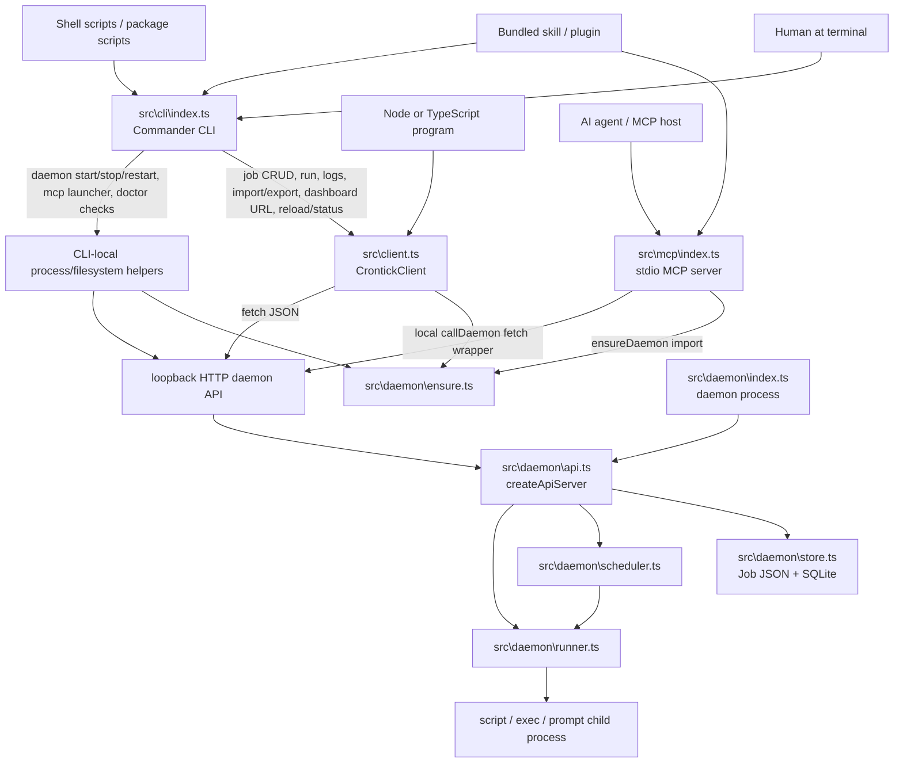

# API vs CLI architecture analysis

## Decision

Keep both the command-line interface and the programmatic API for public release, but treat the programmatic client/core as the source of truth. The CLI and MCP server should be thin adapters over that client/core. The loopback HTTP daemon API should remain an internal transport between processes, not the documented public integration contract.

If crontick were forced to keep only one product surface, the programmatic client/core is the more important architectural primitive because it can power the CLI, MCP, tests, extensions, and future UI/agent integrations. As a product, however, crontick needs both: humans need a terminal UX, while embedders and AI-first integrations need a typed, non-shell API.

## Current architecture



Current real layering:

- `package.json` ships three binaries (`crontick`, `crontick-daemon`, `crontick-mcp`) and a package root export for `createClient()` / `CrontickClient` (`package.json:20-34`).
- `src\index.ts` exports the client, daemon ensure helpers, schemas, paths, and types (`src\index.ts:1-20`). This already makes more than the CLI a public package surface.
- The CLI imports `createClient()` and `normalizeJobInput()` (`src\cli\index.ts:11-12`). Its `client()` helper creates `CrontickClient` with the built daemon script path (`src\cli\index.ts:46-48`).
- Most daemon-backed CLI commands call client methods: `list`, `get`, `enable`, `disable`, `delete`, `run-now`, `logs`, `export`, `import`, `daemon status`, `daemon reload`, and `dashboard` (`src\cli\index.ts:298`, `312`, `326`, `338`, `350`, `364`, `381`, `409`, `430`, `591`, `603`, `696`).
- `new` is an adapter-heavy CLI command: it parses flags, builds schedule/action objects, handles `--file`, normalizes prompt files, validates `JobSchema`, and then calls `client().createJob()` (`src\cli\index.ts:185-285`).
- The client is a daemon-aware HTTP wrapper: it normalizes create/update/import inputs, ensures the daemon by default, resolves the loopback URL, sends JSON via `fetch`, and maps daemon errors to `CrontickError` (`src\client.ts:28-43`, `54-68`, `111-124`, `141-183`).
- The daemon HTTP API is the actual process boundary. `src\daemon\api.ts` accepts loopback-only requests, validates persisted job JSON, then calls Store/Scheduler/Runner (`src\daemon\api.ts:46-55`, `98-170`, `223-317`).
- The daemon process owns durable state and execution: it opens the store, loads jobs, schedules enabled jobs, listens on an ephemeral `127.0.0.1` port, and writes the port file (`src\daemon\index.ts:98-154`).
- The MCP server does **not** use `CrontickClient` today. It imports `ensureDaemon()` / `resolveDaemonBaseUrl()`, but defines its own `callDaemon()` fetch wrapper and hard-codes daemon endpoints in tool/resource handlers (`src\mcp\index.ts:19`, `31-60`, `120-459`, `559-700`).

## HTTP daemon API as a third surface

The HTTP API exists, but it should be treated as an internal transport rather than the public API:

- It binds only to loopback and rejects non-loopback sockets (`src\daemon\api.ts:46-55`).
- It listens on a random port discovered via the port file (`src\daemon\index.ts:148-154`).
- It has no remote auth model; the README explicitly defines the trust boundary as the local user session (`README.md:38-42`).
- It accepts normalized persisted job JSON only; caller-side sugar such as `promptFile` belongs in the CLI/client normalizer, not in the daemon (see the design model artifact).

This makes the client more, not less, important. The client hides daemon start/probe mechanics, transport errors, endpoint paths, JSON parsing, and prompt-file normalization behind a typed API. Public consumers should not be told to read pid/port files or call ephemeral loopback endpoints directly.

## Consumer to surface matrix

| Consumer | Primary surface | Secondary surface | Needs | Why this surface fits |
|---|---|---|---|---|
| Human at terminal | CLI | Dashboard, MCP via host config | Discover commands, create jobs quickly, inspect runs/logs, explicit daemon lifecycle, copy/paste examples | CLI is the lowest-friction public UX and works after `npm install -g crontick`. It can present friendly errors and table/JSON output. |
| Shell scripts / CI / dotfiles | CLI with `--json` | Programmatic API for richer scripts | Stable process exit codes, JSON output, no TypeScript setup | CLI is scriptable and language-agnostic, but should stay thin to avoid divergent behavior. |
| Node/TypeScript embedding app | Programmatic API (`createClient`) | None, unless spawning MCP for AI hosts | Typed methods, exceptions, no shell quoting, daemon on-demand, direct objects | The client avoids fragile stdout parsing and can evolve with TypeScript types and semver. |
| AI agent / MCP client | MCP tools/resources/prompts | CLI fallback when MCP unavailable | Tool schemas, confirmable destructive actions, schedule preview, resources/logs, prompt workflows | MCP is the native AI surface. It exposes intent-specific tools and resources rather than asking an LLM to synthesize shell commands. |
| Bundled skill / Copilot plugin | MCP first; CLI fallback/install/doctor | Programmatic API if future extension code embeds crontick | Install verification, teach LLM workflow, validate/preview before creation | `plugin\install.mjs` uses `crontick doctor`; `src\skill\SKILL.md` prefers MCP tools and uses CLI examples/fallback (`plugin\install.mjs:73-74`, `src\skill\SKILL.md:95-108`, `254-286`). |
| Daemon process | Internal HTTP handlers + Store/Scheduler/Runner | None | Local process boundary, durable state, scheduling, run execution | The daemon should not call the CLI or public client; it owns the authoritative state machine. |
| Dashboard/static UI | Internal HTTP API | Future public client if dashboard is split out | Read jobs/runs/stats from same local daemon | Today the dashboard is served by the daemon and can use internal HTTP because it is part of the same product package. |

## Option analysis

### CLI-only

Benefits:

- Smallest public mental model: install one binary and run commands.
- Easy for humans, demos, README examples, shell scripts, and plugin install checks.
- Avoids semver promises for TypeScript classes and package exports.

Disadvantages:

- Bad embedding story: Node/TS callers must spawn a process, quote arguments, parse stdout/stderr, and handle platform differences.
- AI integrations become brittle if they must synthesize shell commands instead of using typed tool schemas.
- Long prompt text, prompt files, engine args, and session controls are exactly where shell quoting is most fragile.
- Testing only through CLI is slower and less precise than testing a client/core directly.
- A CLI cannot cleanly power MCP without either shelling out or duplicating HTTP logic.

CLI-only would make crontick feel like a utility, not a reusable scheduling platform.

### API-only

Benefits:

- One typed source of truth for daemon ensure, validation, job creation, and errors.
- Best surface for embedders, tests, future GUIs, and extension code.
- Avoids command parsing/output formatting drift.

Disadvantages:

- Poor first-run experience for a public cron tool; users expect `crontick new`, `crontick list`, and `crontick logs`.
- Shell users, docs, plugin install scripts, and non-Node automation lose the simplest integration path.
- Daemon lifecycle and doctor checks become awkward without a binary.
- Public release discoverability suffers: npm packages with only library APIs are harder to demo for local automation.

API-only is architecturally clean but product-poor for a local cron daemon.

### Both CLI and API

Benefits:

- Serves both human and embedding workflows without forcing one consumer through another consumer's UX.
- Lets the CLI be a friendly adapter while the client/core remains the stable behavior layer.
- Gives AI-first crontick three complementary surfaces: MCP for agents, API for extension/host code, CLI for human fallback and local scripts.
- The daemon HTTP API can remain private and evolvable because public consumers use CLI/client/MCP.

Disadvantages:

- More public surface area to document and version.
- Drift risk if CLI, client, MCP, and HTTP each encode endpoint paths, defaults, validation, or doctor logic separately.
- Higher test burden: parity tests must cover CLI/client/MCP/API creation, prompt-file normalization, errors, and daemon start policy.
- Public release requires a clear statement of which exports are stable and which are internal/advanced.

Both is the right product architecture, but only if the implementation keeps one source of truth.

## Duplication and drift found

| Area | Evidence | Impact | Suggested direction |
|---|---|---|---|
| CLI create normalizes and validates before calling client, while client also normalizes and validates create input | CLI file mode normalizes at `src\cli\index.ts:190-198`; flag mode normalizes at `src\cli\index.ts:268-279`; CLI validates `JobSchema` at `src\cli\index.ts:279-284`; client normalizes again at `src\client.ts:41-43` through `normalizeJobInput()` (`src\job-input.ts:46-59`). | Mostly safe, but validation errors and prompt-file base-dir behavior can diverge. The CLI is not a pure adapter for create. | Let CLI parse flags into `JobCreateInput` and delegate all normalization/validation to a client/core method that accepts per-call normalization options, or explicitly document CLI-only file-relative behavior. |
| CLI supports JSON-file-relative `promptFile`; client only has constructor-level `cwd` | CLI passes `fileBaseDir: dirname(filePath)` for `--file` (`src\cli\index.ts:190-198`). Client options expose only `cwd` (`src\client.ts:15-18`) and `createJob()` passes that to normalization (`src\client.ts:41-43`). | A Node caller importing a job JSON from disk cannot get the exact same relative prompt-file semantics without pre-normalizing itself. | Add optional per-call normalization options, e.g. `createJob(input, { fileBaseDir })`, or add an import helper to the client. |
| MCP duplicates the client's HTTP transport instead of using the client | MCP defines `callDaemon()` (`src\mcp\index.ts:40-60`) and each tool hard-codes endpoints (`src\mcp\index.ts:144`, `153`, `162-164`, `192-194`, `205-207`, `215-229`, `240-254`, `270-276`, `325-347`, `368-370`, `401`, `445`, `457-458`). | Endpoint/default/error behavior can drift from `CrontickClient.request()` (`src\client.ts:141-183`). It also means client coverage does not prove MCP behavior. | Add missing client methods and have MCP call the client while preserving MCP-specific schemas, redaction, and confirmation language. |
| Client is narrower than MCP/HTTP | Client has run/log/import/export/schedule/reload/status methods (`src\client.ts:83-132`) but lacks MCP-exposed cancel-run and stats methods, while API supports cancel/stats (`src\daemon\api.ts:197-201`, `249-280`) and MCP exposes them (`src\mcp\index.ts:246-256`, `352-371`). | MCP currently has a reason to bypass the client. Public embedders cannot use all daemon capabilities without direct HTTP. | Fill client parity gaps first: `cancelRun`, `statsSummary`, `statsJob`, and possibly a typed `doctor()` result. |
| CLI and MCP duplicate doctor checks | CLI doctor builds Node/SQLite/data-dir/port/daemon/dashboard/MCP checks (`src\cli\index.ts:443-519`). MCP doctor repeats Node/SQLite/data-dir/port/daemon/dashboard/MCP checks (`src\mcp\index.ts:478-554`). | Diagnostics can drift; MCP description already contains repeated wording (`src\mcp\index.ts:481-482`). | Extract a shared no-start doctor service used by CLI and MCP. |
| Daemon start/restart logic is split across CLI and ensure | CLI `daemon start` spawns the daemon and waits for a port file (`src\cli\index.ts:535-561`); CLI `daemon restart` repeats stop/spawn/wait (`src\cli\index.ts:611-636`); shared ensure has a richer lock/health/start path (`src\daemon\ensure.ts:53-112`, `114-199`). | Explicit lifecycle commands may behave differently from demand-start paths under races or failures. | Reuse shared start/probe helpers for explicit daemon commands while preserving the command semantics (`start` starts, `restart` restarts, `status` never starts). |

## Recommendation

Keep both CLI and programmatic API, and keep MCP as the AI-native public adapter. Do not collapse the project to only one of them.

Target layering for public release:

```text
Public adapters:
  crontick CLI  ─┐
  crontick MCP  ─┼─> public client/core -> internal daemon transport -> daemon core
  Node/TS API   ─┘

Internal implementation:
  daemon HTTP API -> Store + Scheduler + Runner
```

More concretely:

1. The stable behavioral source should be a public client/core layer, not CLI command handlers and not raw HTTP.
2. CLI should parse arguments, handle files/stdin/stdout, render human output, and call the client/core.
3. MCP should define AI-friendly tool schemas/resources/prompts, enforce confirmation/redaction conventions, and call the same client/core.
4. HTTP should remain the process-local transport between client/core and daemon. It should be tested, but not promoted as the supported integration API.
5. The daemon should stay independent of public adapters and own state, scheduling, and execution.

This aligns with the intended design artifacts: shared daemon ensure, caller-side prompt-file normalization, a programmatic `CrontickClient`, and CLI/client parity were explicit design goals. It also aligns with the adversarial review's conclusion that the layering is coherent but should keep shared behavior central.

## Low-risk refactor steps

Do not start by deleting surfaces. Instead, reduce drift in small, behavior-preserving steps:

1. Add missing `CrontickClient` methods for existing HTTP/MCP capabilities: `cancelRun()`, `statsSummary()`, `statsJob()`, and a typed no-start `doctor()` helper.
2. Add per-call normalization options or an import helper so client callers can match CLI `--file` prompt-file resolution.
3. Refactor MCP tools/resources to construct a `CrontickClient` and call client methods. Keep MCP schemas/descriptions/redaction intact.
4. Extract shared doctor checks into a module used by CLI and MCP; keep `doctor` no-start.
5. Refactor CLI `new` so command code only parses CLI syntax and delegates normalization/validation to the client/core. Preserve current output and error text where tests depend on it.
6. Reuse shared daemon start/probe helpers from `src\daemon\ensure.ts` for explicit CLI/MCP restart paths, while keeping `daemon status`, `doctor`, and help/version no-start.
7. Add/keep parity tests for CLI/client/MCP create/update/import, prompt-file sugar, schedule preview/validation, daemon start policy, and error messages.
8. Update public docs after code refactors so the documented architecture says: CLI and MCP are adapters over the client/core; HTTP is internal.

## Public release implications

For a public release, explicitly separate stable public contracts from internal implementation details.

Stable/public documentation should cover:

- CLI commands, flags, exit behavior, and `--json` output compatibility expectations.
- MCP tool/resource/prompt names and input schemas, because agents and skills will depend on them.
- Package root API: `createClient()`, `CrontickClient`, job/schedule/action types, and supported errors.
- Persisted normalized job JSON enough for export/import and backup/restore.

Document as internal or advanced unless intentionally committed to semver:

- Loopback HTTP endpoint paths and response shapes.
- pid/port file locations and daemon lock files.
- Low-level path helpers and daemon ensure helpers exported from `src\index.ts` (`src\index.ts:3-18`). If these remain exported for v1, either document them as stable advanced APIs or narrow the export surface before v1.

The public-release message should be: use the CLI if you are a human or shell script, use MCP if you are an AI host/agent, and use `createClient()` if you are writing Node/TypeScript. Do not integrate by scraping daemon port files or calling the daemon HTTP API directly.

## AI-first implications

An AI-first cron needs surfaces that are both agent-friendly and safe:

- MCP is essential because AI hosts need declarative tools, schemas, resources, prompts, and confirmation guidance. It is the best surface for scheduling prompts/agents.
- The programmatic API is essential because future Copilot extensions, desktop apps, web dashboards, or agent runtimes may want to create jobs without an MCP round trip or shell command.
- The CLI remains essential because agents often need to show users an exact fallback command, plugin installers need a simple `doctor`, and humans need to inspect or repair state outside an AI host.
- The daemon HTTP API is necessary for process isolation, but making it the public contract would push AI clients toward low-level transport details rather than intent-level operations.

Therefore the architecture should be multi-surface at the edges, single-source in the middle.
